# Test Framework Lifecycle Hooks Execution Order Comparison

## Test Structure

The following test structure is used across all frameworks:

- **Top-level**
  - beforeAll/before
  - beforeEach
  - afterEach
  - afterAll/after
  - **Main describe block**
    - beforeAll/before
    - beforeEach
    - afterEach
    - afterAll/after
    - 🧪 Main Test 01
    - 🧪 Main Test 02
    - **Nested describe block**
      - beforeAll/before
      - beforeEach
      - afterEach
      - afterAll/after
      - 🧪 Nested Test 01
      - 🧪 Nested Test 02

## Execution Order Table

| Order | Mocha | Jest | Vitest | Bun |
|------|-------|------|--------|-----|
| 1 | top-level before | top-level beforeAll | top-level beforeAll | top-level beforeAll |
| 2 | main before | main beforeAll | main beforeAll | main beforeAll |
| 3 | top-level beforeEach | top-level beforeEach | top-level beforeEach | nested beforeAll |
| 4 | main beforeEach → 🧪 **main test 01** | main beforeEach → 🧪 **main test 01** | main beforeEach → 🧪 **main test 01** | top-level beforeEach |
| 5 | main afterEach | main afterEach | main afterEach | main beforeEach |
| 6 | top-level afterEach | top-level afterEach | top-level afterEach | nested beforeEach → 🧪 **nested test 01** |
| 7 | top-level beforeEach | nested beforeAll | nested beforeAll | nested afterEach |
| 8 | main beforeEach → 🧪 **main test 02** | top-level beforeEach | top-level beforeEach | main afterEach |
| 9 | main afterEach | main beforeEach | main beforeEach | top-level afterEach |
| 10 | top-level afterEach | nested beforeEach → 🧪 **nested test 01** | nested beforeEach → 🧪 **nested test 01** | top-level beforeEach |
| 11 | nested before | nested afterEach | nested afterEach | main beforeEach |
| 12 | top-level beforeEach | main afterEach | main afterEach | nested beforeEach → 🧪 **nested test 02** |
| 13 | main beforeEach | top-level afterEach | top-level afterEach | nested afterEach |
| 14 | nested beforeEach → 🧪 **nested test 01** | top-level beforeEach | top-level beforeEach | main afterEach |
| 15 | nested afterEach | main beforeEach | main beforeEach | top-level afterEach |
| 16 | main afterEach | nested beforeEach → 🧪 **nested test 02** | nested beforeEach → 🧪 **nested test 02** | nested afterAll |
| 17 | top-level afterEach | nested afterEach | nested afterEach | top-level beforeEach |
| 18 | top-level beforeEach | main afterEach | main afterEach | main beforeEach → 🧪 **main test 01** |
| 19 | main beforeEach | top-level afterEach | top-level afterEach | main afterEach |
| 20 | nested beforeEach → 🧪 **nested test 02** | nested afterAll | nested afterAll | top-level afterEach |
| 21 | nested afterEach | top-level beforeEach | top-level beforeEach | top-level beforeEach |
| 22 | main afterEach | main beforeEach → 🧪 **main test 02** | main beforeEach → 🧪 **main test 02** | main beforeEach → 🧪 **main test 02** |
| 23 | top-level afterEach | main afterEach | main afterEach | main afterEach |
| 24 | nested after | top-level afterEach | top-level afterEach | top-level afterEach |
| 25 | main after | main afterAll | main afterAll | main afterAll |
| 26 | top-level after | top-level afterAll | top-level afterAll | top-level afterAll |

## Key Differences

### Hook Naming
- **Mocha**: Uses `before`, `after`, `beforeEach`, `afterEach`
- **Jest/Vitest/Bun**: Uses `beforeAll`, `afterAll`, `beforeEach`, `afterEach`

### Test Execution Order Patterns
1. **Mocha**: Tests run in strict order within their describe blocks
   - **main test 01** → **main test 02** → **nested test 01** → **nested test 02**

2. **Jest & Vitest**: Tests run with nested tests executing before remaining main tests
   - **main test 01** → **nested test 01** → **nested test 02** → **main test 02**

3. **Bun**: All nested tests execute first, then all main tests
   - **nested test 01** → **nested test 02** → **main test 01** → **main test 02**

### Hook Execution Order Patterns
1. **Jest & Vitest**: Nearly identical execution order - runs outer `beforeAll` hooks first, then processes tests with nested hooks in sequence
2. **Bun**: Similar to Jest/Vitest but executes nested `beforeAll` earlier (step 3)
3. **Mocha**: Executes main tests first, then nested tests, with all their respective `before` hooks

### Notable Behaviors
- All frameworks execute hooks from outer to inner scope for `beforeEach` and inner to outer for `afterEach`
- `beforeAll`/`before` hooks run once per describe block before any tests
- `afterAll`/`after` hooks run once per describe block after all tests complete
- **Test ordering varies significantly** between frameworks, affecting when setup/teardown occurs for different test groups

## Common Lifecycle Hooks Pattern

### Execution Order Visualization

This diagram shows how:
1. **Setup hooks** (`beforeAll`/`before`) execute from outer to inner scope
2. **Test hooks** (`beforeEach`/`afterEach`) wrap each test, with `beforeEach` running outer→inner and `afterEach` running inner→outer
3. **Teardown hooks** (`afterAll`/`after`) execute from inner to outer scope

## ⚠️ Counterintuitive Behavior: Nested beforeAll Timing

### The Surprising Execution Order

```mermaid
graph TD
    subgraph "❌ What You Might Expect"
        A1[top-level beforeEach] --> B1[main beforeEach]
        B1 --> C1[nested beforeEach]
        C1 --> D1[nested beforeAll]
        D1 --> E1[test in nested]
    end

    subgraph "✅ What Actually Happens"
        A2[nested beforeAll] --> B2[top-level beforeEach]
        B2 --> C2[main beforeEach]
        C2 --> D2[nested beforeEach]
        D2 --> E2[test in nested]
    end

    style D1 fill:#FFB6C1
    style A2 fill:#FFB6C1
```

### Execution Order for Nested Tests

```mermaid
sequenceDiagram
    participant NBA as nested beforeAll ⚠️
    participant TLBE as top-level beforeEach
    participant MBE as main beforeEach
    participant NBE as nested beforeEach
    participant T as Test

    Note over NBA: Runs FIRST!
    NBA->>NBA: Execute
    TLBE->>TLBE: Execute
    MBE->>MBE: Execute
    NBE->>NBE: Execute
    T->>T: Run Test
```

**Key Point**: `nested beforeAll` runs BEFORE the `beforeEach` hooks, not after!