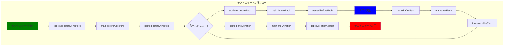
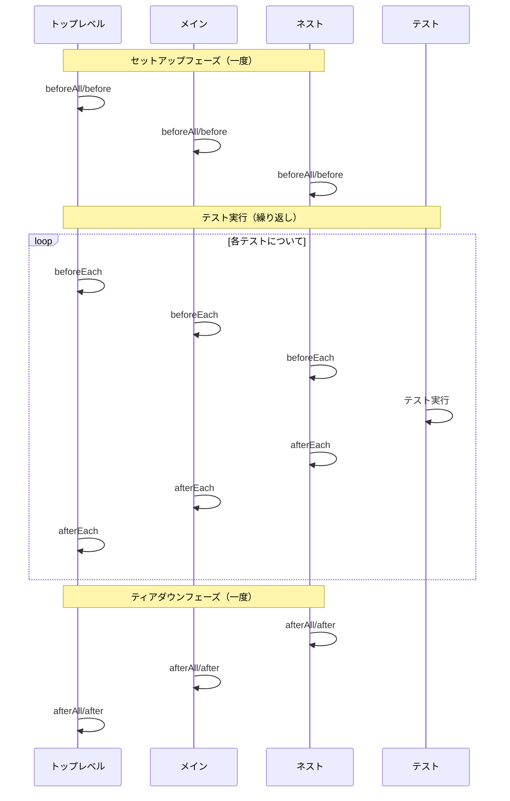
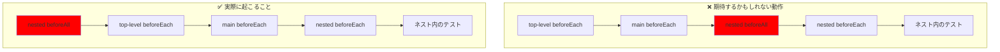
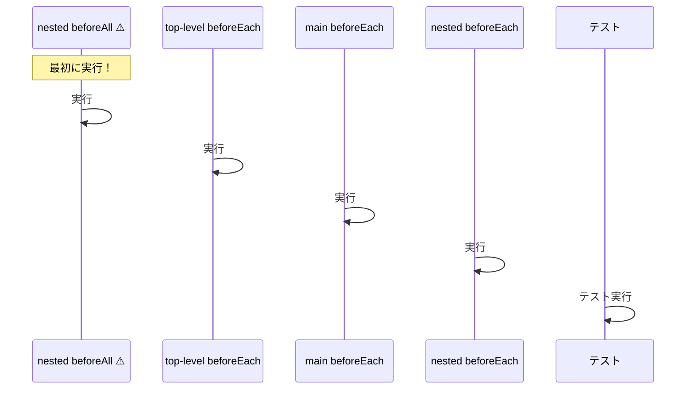

<!-- cspell:ignore texttt TLBE -->

# テストフレームワーク ライフサイクルフック実行順序比較

## テスト構造

すべてのフレームワークで以下のテスト構造が使用されています：

- **$\texttt{\color{#4A90E2}Top-level}$**
  - beforeAll/before
  - beforeEach
  - afterEach
  - afterAll/after
  - **$\texttt{\color{#7CB342}Main describe block}$**
    - beforeAll/before
    - beforeEach
    - afterEach
    - afterAll/after
    - 🧪 $\texttt{\color{#7CB342}main}$ テスト 01
    - 🧪 $\texttt{\color{#7CB342}main}$ テスト 02
    - **$\texttt{\color{#E85D75}Nested describe block}$**
      - beforeAll/before
      - beforeEach
      - afterEach
      - afterAll/after
      - 🧪 $\texttt{\color{#E85D75}Nested}$ テスト 01
      - 🧪 $\texttt{\color{#E85D75}Nested}$ テスト 02

## 実行順序テーブル

| 実行順序 | Mocha | Jest | Vitest | Bun Test |
|---------|-------|--------|------|----------|
| 1 | $\texttt{\color{#4A90E2}top-level}$ before | $\texttt{\color{#4A90E2}top-level}$ beforeAll | $\texttt{\color{#4A90E2}top-level}$ beforeAll | $\texttt{\color{#4A90E2}top-level}$ beforeAll |
| 2 | $\texttt{\color{#7CB342}main}$ before | $\texttt{\color{#7CB342}main}$ beforeAll | $\texttt{\color{#7CB342}main}$ beforeAll | $\texttt{\color{#7CB342}main}$ beforeAll |
| 3 | $\texttt{\color{#4A90E2}top-level}$ beforeEach | $\texttt{\color{#4A90E2}top-level}$ beforeEach | $\texttt{\color{#4A90E2}top-level}$ beforeEach | $\texttt{\color{#E85D75}nested}$ beforeAll |
| 4 | $\texttt{\color{#7CB342}main}$ beforeEach | $\texttt{\color{#7CB342}main}$ beforeEach | $\texttt{\color{#7CB342}main}$ beforeEach | $\texttt{\color{#4A90E2}top-level}$ beforeEach |
| 5 | 🧪 **$\texttt{\color{#7CB342}main}$ test 01** | 🧪 **$\texttt{\color{#7CB342}main}$ test 01** | 🧪 **$\texttt{\color{#7CB342}main}$ test 01** | $\texttt{\color{#7CB342}main}$ beforeEach |
| 6 | $\texttt{\color{#7CB342}main}$ afterEach | $\texttt{\color{#7CB342}main}$ afterEach | $\texttt{\color{#7CB342}main}$ afterEach | $\texttt{\color{#E85D75}nested}$ beforeEach |
| 7 | $\texttt{\color{#4A90E2}top-level}$ afterEach | $\texttt{\color{#4A90E2}top-level}$ afterEach | $\texttt{\color{#4A90E2}top-level}$ afterEach | 🧪 **$\texttt{\color{#E85D75}nested}$ test 01** |
| 8 | $\texttt{\color{#4A90E2}top-level}$ beforeEach | $\texttt{\color{#E85D75}nested}$ beforeAll | $\texttt{\color{#E85D75}nested}$ beforeAll | $\texttt{\color{#E85D75}nested}$ afterEach |
| 9 | $\texttt{\color{#7CB342}main}$ beforeEach | $\texttt{\color{#4A90E2}top-level}$ beforeEach | $\texttt{\color{#4A90E2}top-level}$ beforeEach | $\texttt{\color{#7CB342}main}$ afterEach |
| 10 | 🧪 **$\texttt{\color{#7CB342}main}$ test 02** | $\texttt{\color{#7CB342}main}$ beforeEach | $\texttt{\color{#7CB342}main}$ beforeEach | $\texttt{\color{#4A90E2}top-level}$ afterEach |
| 11 | $\texttt{\color{#7CB342}main}$ afterEach | $\texttt{\color{#E85D75}nested}$ beforeEach | $\texttt{\color{#E85D75}nested}$ beforeEach | $\texttt{\color{#4A90E2}top-level}$ beforeEach |
| 12 | $\texttt{\color{#4A90E2}top-level}$ afterEach | 🧪 **$\texttt{\color{#E85D75}nested}$ test 01** | 🧪 **$\texttt{\color{#E85D75}nested}$ test 01** | $\texttt{\color{#7CB342}main}$ beforeEach |
| 13 | $\texttt{\color{#E85D75}nested}$ before | $\texttt{\color{#E85D75}nested}$ afterEach | $\texttt{\color{#E85D75}nested}$ afterEach | $\texttt{\color{#E85D75}nested}$ beforeEach |
| 14 | $\texttt{\color{#4A90E2}top-level}$ beforeEach | $\texttt{\color{#7CB342}main}$ afterEach | $\texttt{\color{#7CB342}main}$ afterEach | 🧪 **$\texttt{\color{#E85D75}nested}$ test 02** |
| 15 | $\texttt{\color{#7CB342}main}$ beforeEach | $\texttt{\color{#4A90E2}top-level}$ afterEach | $\texttt{\color{#4A90E2}top-level}$ afterEach | $\texttt{\color{#E85D75}nested}$ afterEach |
| 16 | $\texttt{\color{#E85D75}nested}$ beforeEach | $\texttt{\color{#4A90E2}top-level}$ beforeEach | $\texttt{\color{#4A90E2}top-level}$ beforeEach | $\texttt{\color{#7CB342}main}$ afterEach |
| 17 | 🧪 **$\texttt{\color{#E85D75}nested}$ test 01** | $\texttt{\color{#7CB342}main}$ beforeEach | $\texttt{\color{#7CB342}main}$ beforeEach | $\texttt{\color{#4A90E2}top-level}$ afterEach |
| 18 | $\texttt{\color{#E85D75}nested}$ afterEach | $\texttt{\color{#E85D75}nested}$ beforeEach | $\texttt{\color{#E85D75}nested}$ beforeEach | $\texttt{\color{#E85D75}nested}$ afterAll |
| 19 | $\texttt{\color{#7CB342}main}$ afterEach | 🧪 **$\texttt{\color{#E85D75}nested}$ test 02** | 🧪 **$\texttt{\color{#E85D75}nested}$ test 02** | $\texttt{\color{#4A90E2}top-level}$ beforeEach |
| 20 | $\texttt{\color{#4A90E2}top-level}$ afterEach | $\texttt{\color{#E85D75}nested}$ afterEach | $\texttt{\color{#E85D75}nested}$ afterEach | $\texttt{\color{#7CB342}main}$ beforeEach |
| 21 | $\texttt{\color{#4A90E2}top-level}$ beforeEach | $\texttt{\color{#7CB342}main}$ afterEach | $\texttt{\color{#7CB342}main}$ afterEach | 🧪 **$\texttt{\color{#7CB342}main}$ test 01** |
| 22 | $\texttt{\color{#7CB342}main}$ beforeEach | $\texttt{\color{#4A90E2}top-level}$ afterEach | $\texttt{\color{#4A90E2}top-level}$ afterEach | $\texttt{\color{#7CB342}main}$ afterEach |
| 23 | $\texttt{\color{#E85D75}nested}$ beforeEach | $\texttt{\color{#E85D75}nested}$ afterAll | $\texttt{\color{#E85D75}nested}$ afterAll | $\texttt{\color{#4A90E2}top-level}$ afterEach |
| 24 | 🧪 **$\texttt{\color{#E85D75}nested}$ test 02** | $\texttt{\color{#4A90E2}top-level}$ beforeEach | $\texttt{\color{#4A90E2}top-level}$ beforeEach | $\texttt{\color{#4A90E2}top-level}$ beforeEach |
| 25 | $\texttt{\color{#E85D75}nested}$ afterEach | $\texttt{\color{#7CB342}main}$ beforeEach | $\texttt{\color{#7CB342}main}$ beforeEach | $\texttt{\color{#7CB342}main}$ beforeEach |
| 26 | $\texttt{\color{#7CB342}main}$ afterEach | 🧪 **$\texttt{\color{#7CB342}main}$ test 02** | 🧪 **$\texttt{\color{#7CB342}main}$ test 02** | 🧪 **$\texttt{\color{#7CB342}main}$ test 02** |
| 27 | $\texttt{\color{#4A90E2}top-level}$ afterEach | $\texttt{\color{#7CB342}main}$ afterEach | $\texttt{\color{#7CB342}main}$ afterEach | $\texttt{\color{#7CB342}main}$ afterEach |
| 28 | $\texttt{\color{#E85D75}nested}$ after | $\texttt{\color{#4A90E2}top-level}$ afterEach | $\texttt{\color{#4A90E2}top-level}$ afterEach | $\texttt{\color{#4A90E2}top-level}$ afterEach |
| 29 | $\texttt{\color{#7CB342}main}$ after | $\texttt{\color{#7CB342}main}$ afterAll | $\texttt{\color{#7CB342}main}$ afterAll | $\texttt{\color{#7CB342}main}$ afterAll |
| 30 | $\texttt{\color{#4A90E2}top-level}$ after | $\texttt{\color{#4A90E2}top-level}$ afterAll | $\texttt{\color{#4A90E2}top-level}$ afterAll | $\texttt{\color{#4A90E2}top-level}$ afterAll |

## 主な違い

### フック名の違い
- **Mocha**: `before`, `after`, `beforeEach`, `afterEach` を使用
- **Jest/Vitest/Bun**: `beforeAll`, `afterAll`, `beforeEach`, `afterEach` を使用

### テスト実行順序パターン
1. **Mocha**: テストはdescribeブロック内で厳密な順序で実行される
   - **$\texttt{\color{#7CB342}メイン}$ テスト 01** → **$\texttt{\color{#7CB342}メイン}$ テスト 02** → **$\texttt{\color{#E85D75}ネスト}$ テスト 01** → **$\texttt{\color{#E85D75}ネスト}$ テスト 02**

2. **Jest & Vitest**: ネストされたテストが残りのメインテストより先に実行される
   - **$\texttt{\color{#7CB342}メイン}$ テスト 01** → **$\texttt{\color{#E85D75}ネスト}$ テスト 01** → **$\texttt{\color{#E85D75}ネスト}$ テスト 02** → **$\texttt{\color{#7CB342}メイン}$ テスト 02**

3. **Bun**: すべてのネストテストが最初に実行され、その後すべてのメインテストが実行される
   - **$\texttt{\color{#E85D75}ネスト}$ テスト 01** → **$\texttt{\color{#E85D75}ネスト}$ テスト 02** → **$\texttt{\color{#7CB342}メイン}$ テスト 01** → **$\texttt{\color{#7CB342}メイン}$ テスト 02**

### フック実行順序パターン
1. **Jest & Vitest**: ほぼ同一の実行順序 - 外側の `beforeAll` フックを最初に実行し、その後ネストされたフックとともにテストを順次処理
2. **Bun**: Jest/Vitestと似ているが、ネストされた `beforeAll` がより早く（ステップ3で）実行される
3. **Mocha**: メインテストを最初に実行し、その後ネストされたテストを、それぞれの `before` フックとともに実行

### 注目すべき動作
- すべてのフレームワークで、`beforeEach` は外側から内側のスコープへ、`afterEach` は内側から外側へフックを実行する
- `beforeAll`/`before` フックは、各describeブロックでテストの実行前に一度実行される
- `afterAll`/`after` フックは、各describeブロックですべてのテスト完了後に一度実行される
- **テスト順序がフレームワーク間で大きく異なり**、異なるテストグループのセットアップ/ティアダウンがいつ発生するかに影響する

## 共通のライフサイクルフックパターン

### 実行順序の可視化

この図は以下のことを示しています：
1. **セットアップフック**（`beforeAll`/`before`）は外側から内側のスコープへ実行される
2. **テストフック**（`beforeEach`/`afterEach`）は各テストをラップし、`beforeEach` は外側→内側、`afterEach` は内側→外側で実行される
3. **ティアダウンフック**（`afterAll`/`after`）は内側から外側のスコープへ実行される

## ⚠️ 直感に反する動作：ネストされたbeforeAllのタイミング

### 驚くべき実行順序

### ネストされたテストの実行順序

**重要なポイント**: `nested beforeAll` は `beforeEach` フックの後ではなく、前に実行されます！